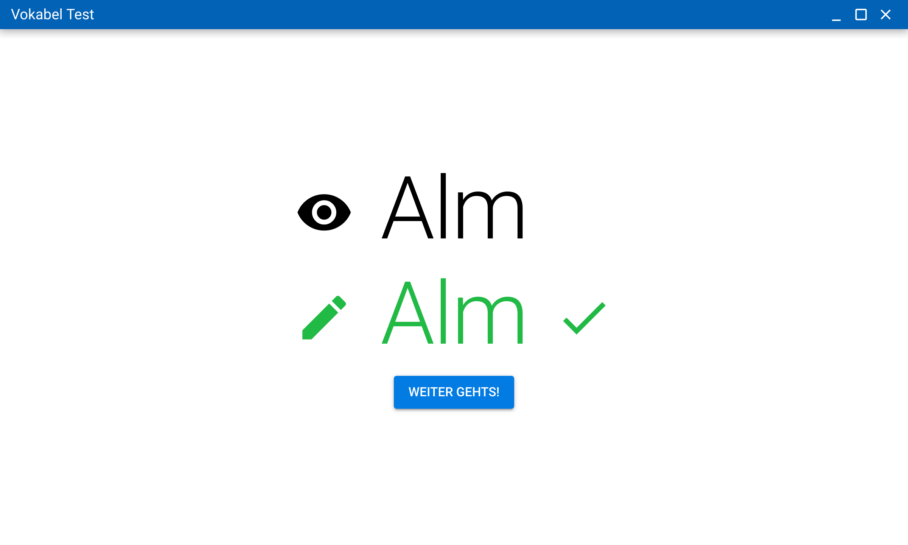

# Readme

## Description

This is a simple application for practicing the spelling of vocabulary. The user interface is in german language, but
as most elements are iconographic, this should be not an issue for speakers of other languages.

The vocabulary for a training session is defined in a file `vocabulary.txt` in the user configuration directory. If it
is yet empty, you will be notified on startup. A button is provided as a shortcut to open that file.

To change the vocabulary for training, the application has to be closed and reopened, as the words are stored in memory
at the beginning of the session.

## Path of vocabulary file per OS

* Linux: `~/.config/Vocabulary Test/vocabulary.txt`
* Mac: `/Users/{USER_NAME}/Library/Application\ Support/Vocabulary\ Test/`
* Windows: :question:

## Development Dependencies

Only applies, when developing on Linux.

* [Wine](https://wiki.winehq.org/Download#binary)
* [Mono](https://wiki.winehq.org/Mono)

## Production build

Every build command will clear the dist folder before creating resources anew.

If you did not build the application before, then you have to invoke `npm install` first.

* `npm run build` (build for all platforms)
* `npm run build-linux`(build for linux)
* `npm run build-mac` (build for mac)
* `npm run build-win` (build for windows)

## Development build & Run

* `npm install`
* `npm start`
